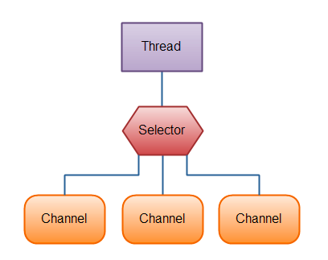
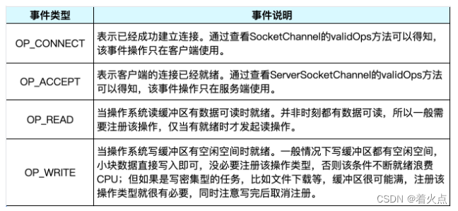

### Channel
当JVM外向JVM内传数据时，channel起到连接作用
* 支持异步读写
* 与buffer的关系\
  
* 有阻塞式和非阻塞式两种，nio的channel是非阻塞式的
* wakeUp()：调用selector后阻塞，再调用wakeUp()可以立刻返回
* java中的channel实现类：
  * FileChannel：读写文件
  * DatagramChannel：通过UDP向网络读写数据
  * SocketChannel：通过TCP向网络读写数据
  * ServerSocketChannel：可以监听TCP链接。对每个新的链接，创建一个SocketChannel

### Selector
The Java NIO Selector is a component which can examine one or more Java NIO Channel instances, and determine which channels are ready for e.g. reading or writing. \
This way a single thread can manage multiple channels, and thus multiple network connections.\

### SelectionKey
selector中有个SelectionKey的set，其中每个key对应一个注册过事件的channel
* 有四种事件类型：

* interestSet：感兴趣的事件类型集合，以bitMap的形式表示
* readySet：就绪的集合，同样用bitMap表示，初始为0
* 可以通过attach，保存信息

### 参考文章
1. https://jenkov.com/tutorials/java-nio/index.html
2. https://blog.csdn.net/zhaohuodian/article/details/126393290